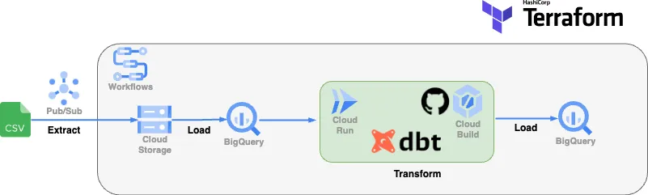

End to End Serverless ELT with Google Cloud, dbt and Terraform
========
The ELT pipeline we’ve developed leverages several Google Cloud Services including Google Cloud Storage (GCS), BigQuery, Pub/Sub, Cloud Workflows, Cloud Run, and Cloud Build. We also use dbt for data transformation and Terraform for infrastructure as code.

Full article 👉 [Medium](https://medium.com/@y.drissislimani/end-to-end-serverless-elt-with-google-cloud-dbt-and-terraform-dd01cf6cba19)

Deploy services in Google Cloud
================

Navigate to **infra folder**, we gonna deploy the project using Terraform :

1. Initialize your Terraform workspace, which will download the provider plugins for Google Cloud: `terraform init`
2. Plan the deployment and review the changes: `terraform plan`
3. If everything looks good, apply the changes: `terraform apply`

Testing
===========================
Finally to test the workflow from end to end, we can lunch the script in **scripts folder**:

`sh upload_include_dataset_to_gcs.sh`

Contact
=======

* [LinkedIn](https://www.linkedin.com/in/dsyouness/)
* [Medium](https://medium.com/@y.drissislimani)