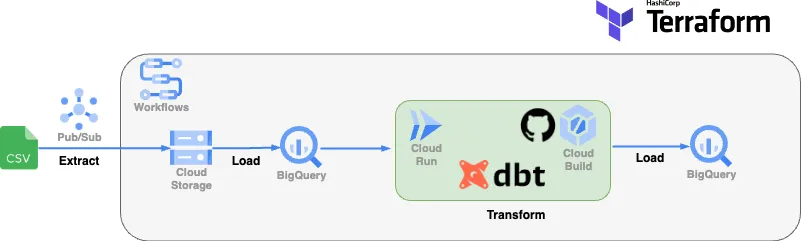

End to End Serverless ELT with Google Cloud, dbt and Terraform
========
The ELT pipeline we’ve developed leverages several Google Cloud Services including Google Cloud Storage (GCS), BigQuery, Pub/Sub, Cloud Workflows, Cloud Run, and Cloud Build. We also use dbt for data transformation and Terraform for infrastructure as code.

This repository now provisions a **Cloud Run Job** (instead of a Cloud Run service endpoint) to execute dbt with a BigQuery-compatible dbt image, then triggers that job from Cloud Workflows.

Full article 👉 [Medium](https://medium.com/@y.drissislimani/end-to-end-serverless-elt-with-google-cloud-dbt-and-terraform-dd01cf6cba19)

Deploy services in Google Cloud
================

Navigate to **infra folder**, we gonna deploy the project using Terraform :

1. Initialize your Terraform workspace, which will download the provider plugins for Google Cloud: `terraform init`
2. Plan the deployment and review the changes: `terraform plan`
3. If everything looks good, apply the changes: `terraform apply`

You can customize the dbt Cloud Run Job image and name using Terraform variables `dbt_image` and `dbt_job_name`.

Testing
===========================
Finally to test the workflow from end to end, we can lunch the script in **scripts folder**:

`sh upload_include_dataset_to_gcs.sh`

Contact
=======

* [LinkedIn](https://www.linkedin.com/in/dsyouness/)
* [Medium](https://medium.com/@y.drissislimani)

Terraform state distant (GCS)
============================

Le state Terraform est prévu pour être stocké dans un bucket GCS via `infra/backend.tf`.

1. Créer le bucket de state (bootstrap, une seule fois) :

`gcloud storage buckets create gs://<TF_STATE_BUCKET> --location=EU --uniform-bucket-level-access`

2. Initialiser Terraform avec le backend GCS :

`terraform -chdir=infra init -backend-config="bucket=<TF_STATE_BUCKET>" -backend-config="prefix=terraform/infra" -migrate-state`

3. Vérifier le plan :

`terraform -chdir=infra plan`

Cloud Build pour créer l'infra Terraform
========================================

Un pipeline `cloudbuild.yaml` a été ajouté pour exécuter `terraform init`, `plan`, puis `apply`.

Exemple d'exécution:

`gcloud builds submit --config=cloudbuild.yaml --substitutions=_TF_STATE_BUCKET=<TF_STATE_BUCKET>,_TF_STATE_PREFIX=terraform/infra`

Le pipeline injecte `project_id` via `${PROJECT_ID}`.

Trigger Cloud Build sur chaque branche
======================================

Terraform crée un trigger Cloud Build qui lance `cloudbuild.yaml` sur chaque push de branche (regex `.*`).

Variables à fournir pour le trigger:

- `github_owner` (owner/org GitHub)
- `github_repo_name` (nom du repo)

Exemple:

`terraform -chdir=infra apply -var="github_owner=<OWNER>" -var="github_repo_name=<REPO>"`

Le build se lance sur toutes les branches, mais `terraform apply` est exécuté uniquement sur `main`.

Le trigger passe aussi `_TF_STATE_BUCKET` et `_TF_STATE_PREFIX` depuis les variables Terraform `tf_state_bucket` et `tf_state_prefix`.
